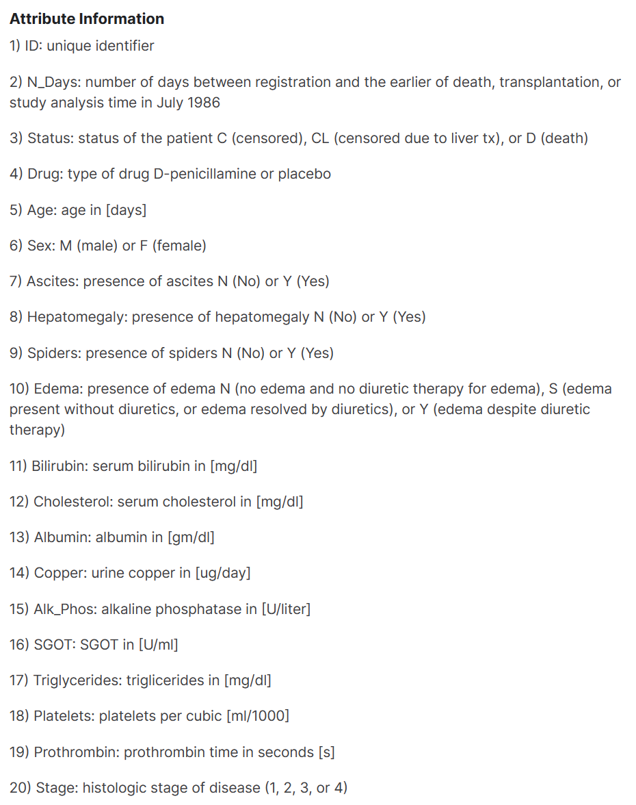

# Prediciton of survival rate of Cirrhosis
## Analyzing diffrent factors the effect the survival rate of Cirrhosis

**Michael Vidales**

### Business Problem:

### Data:
[Cirrhosis Prediction Dataset](https://www.kaggle.com/datasets/fedesoriano/cirrhosis-prediction-dataset)

From this dataset there were 418 participants with 18 features

## Data Dictionary:

